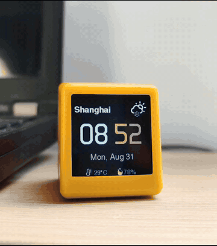

# Rubato

English | [绠€浣撲腑鏂嘳(README.zh-CN.md)

Rubato makes your AI's working state visible 鈥?on a physical desk device.
This repository hosts a Rubato plugin for every supported coding agent,
one directory each. The device firmware lives at
[Rubato_Device](https://github.com/lovaxi/Rubato_Device).
The desk device itself is available now on
[Tindie](https://www.tindie.com/products/beartificialintelligence/rubato-retro-mac-ai-desk-companion/) 鈥?the official store.





```
model call 鈹€鈹€> Rubato plugin 鈹€鈹€> EMQX broker 鈹€鈹€> Rubato device (TFT display)
```

| Directory | Agent | Status |
|---|---|---|
| [dsh/](dsh/) | DeepSeek Harness | available |
| [openclaw/](openclaw/) | OpenClaw | available |
| codex/ | Codex | planned |
| claude-code/ | Claude Code | planned |
| [cursor/](cursor/) | Cursor | available |
| [opencode/](opencode/) | OpenCode | available |

## MQTT contract

All plugins publish the same messages on `rubato/<deviceId>/state` 鈥?
one topic per device. Auth mirrors the device firmware: username = deviceId
(`RUBATO-xxxxxx`), password = its token. MQTT 3.1.1 over TLS (8883), one
persistent connection.

| Message | Payload | Notes |
|---|---|---|
| `Estimate` | `{ model, state, ts, estSec? }` | predicted duration in seconds 鈥?carried by the DSH plugin only (user-side plugins omit it) |
| `Thinking` | `{ model, state, ts }` | first reasoning chunk |
| `Generating` | `{ model, state, ts }` | first answer/tool chunk |
| `Done` | `{ model, state, ts }` | intermediate tool-call steps do not emit Done |

The device shows the model name and a breathing orb that changes color per
phase 鈥?slow cream while thinking, faster ice-blue while generating, a green
flash when done. When the estimate predicts a long run (estSec 鈮?30), the
device shows a full-screen health reminder mid-task 鈥?at most one every
30 minutes (time to drink water / rest).

## Install

### DeepSeek Harness

Paste this into a DSH chat:

```text
Install the Rubato plugin for DSH from https://github.com/lovaxi/Rubato_Plugins/dsh
```

That is the whole install. The assistant copies the plugin package into
place, registers it, and reminds you to restart. After the restart:

1. The console prints a `SETUP REQUIRED` guide and a config template is
   created automatically.
2. Fill the two values from the device sticker 鈥?username = deviceId
   (`RUBATO-xxxxxx`), password = its token 鈥?by editing the file, or just tell
   them to the assistant.

Save 鈥?the plugin auto-enables on the next message; no restart needed.

### OpenCode

Paste this into an opencode chat:

```text
Install the Rubato plugin for OpenCode from https://github.com/lovaxi/Rubato_Plugins/opencode
```

That is the whole install. The assistant copies the plugin package into
place (project `.opencode/plugins/` or global `~/.config/opencode/plugins/`)
and reminds you to restart. After the restart:

1. The console prints a `SETUP REQUIRED` guide and a config template is
   created automatically.
2. Fill the two values from the device sticker 鈥?username = deviceId
   (`RUBATO-xxxxxx`), password = its token 鈥?by editing the file, or just tell
   them to the assistant.

Save 鈥?the plugin auto-enables on the next message; no restart needed.

### Cursor

Cursor is a VS Code fork, so the plugin installs as a VSIX 鈥?no build tools
needed.

**Simplest install 鈥?two steps:**

1. Download the extension:
   [`cursor/rubato-cursor-1.1.0.vsix`](https://github.com/lovaxi/Rubato_Plugins/raw/main/cursor/rubato-cursor-1.1.0.vsix)
2. In Cursor: Extensions panel 鈫?`鈰痐 menu 鈫?**Install from VSIX鈥?* 鈫?pick the
   downloaded file 鈫?reload the window. (Drag-and-drop of the `.vsix` onto
   the Extensions panel works too.)

Prefer the terminal? One line (the `cursor` CLI ships with Cursor):

```powershell
# Windows (PowerShell)
curl.exe -L -o rubato-cursor.vsix https://github.com/lovaxi/Rubato_Plugins/raw/main/cursor/rubato-cursor-1.1.0.vsix; cursor --install-extension rubato-cursor.vsix
```

```bash
# macOS / Linux
curl -L -o rubato-cursor.vsix https://github.com/lovaxi/Rubato_Plugins/raw/main/cursor/rubato-cursor-1.1.0.vsix && cursor --install-extension rubato-cursor.vsix
```

Then configure (once):

1. The console prints a `SETUP REQUIRED` guide and a config template is
   created automatically next to the plugin (`cursor/rubato-mqtt-config.json` 鈥?
   the same file the other Rubato host plugins read on this machine; an old
   `dsh-mqtt-config.json` is migrated in place automatically). Command
   palette 鈫?**Rubato: Open Config File** opens it for you.
2. Fill the two values from the device sticker 鈥?username = deviceId
   (`Cursor-RUBATO-xxxxxx`), password = its token 鈥?by editing the file, or
   just tell them to the assistant.

Save 鈥?the plugin auto-enables on the next edit burst; no restart needed.
A device link check lives in the command palette: **Rubato: Send Test Cycle
to Device**.

**How it works** 鈥?Cursor exposes no public API for its AI chat, so the
plugin watches what the AI provably does to the workspace: rapid,
non-keystroke document edits (Tab completions, Cmd/Ctrl+K, chat Apply, agent
diffs) form an *edit burst* that maps onto the contract sequence above;
small keystroke-scale edits in the focused editor read as human typing and
are ignored.

Commands (command palette): **Rubato: Show Status** 路 **Rubato: Send Test
Cycle to Device** 路 **Rubato: Open Config File**.

Settings: `rubato.modelLabel` (`cursor-agent` 鈥?payload model name),
`rubato.settleMs` (`6000` 鈥?quiet time in ms that closes a burst with Done),
`rubato.minBurstChars` (`12` 鈥?inserted+deleted chars for an edit to count as
AI work in the focused editor), `rubato.maxBurstMs` (`600000` 鈥?safety cap).

<details>
<summary>Build from source (for development)</summary>

```bash
git clone https://github.com/lovaxi/Rubato_Plugins.git
cd Rubato_Plugins/cursor
npx @vscode/vsce package        # -> rubato-cursor-<version>.vsix
```

</details>

### OpenClaw

Paste this into an OpenClaw chat:

```text
Install the Rubato plugin for OpenClaw from https://github.com/lovaxi/Rubato_Plugins/openclaw
```

That is the whole install. The assistant links the plugin package, enables
it, grants the conversation-hook access it needs, and reminds you to restart.
After the restart:

1. The console prints a `SETUP REQUIRED` guide and a config template is
   created automatically.
2. Fill the two values from the device sticker 鈥?username = deviceId
   (`RUBATO-xxxxxx`), password = its token 鈥?by editing the file, or just tell
   them to the assistant.

Save 鈥?the plugin auto-enables on the next message; no restart needed.
OpenClaw's typed hooks have no first-delta event, so `Generating` is not
emitted; the device stays in its thinking breath until `Done`.

### Codex / Claude Code

Planned.

## License

[GPL-3.0](https://www.gnu.org/licenses/gpl-3.0.html)
