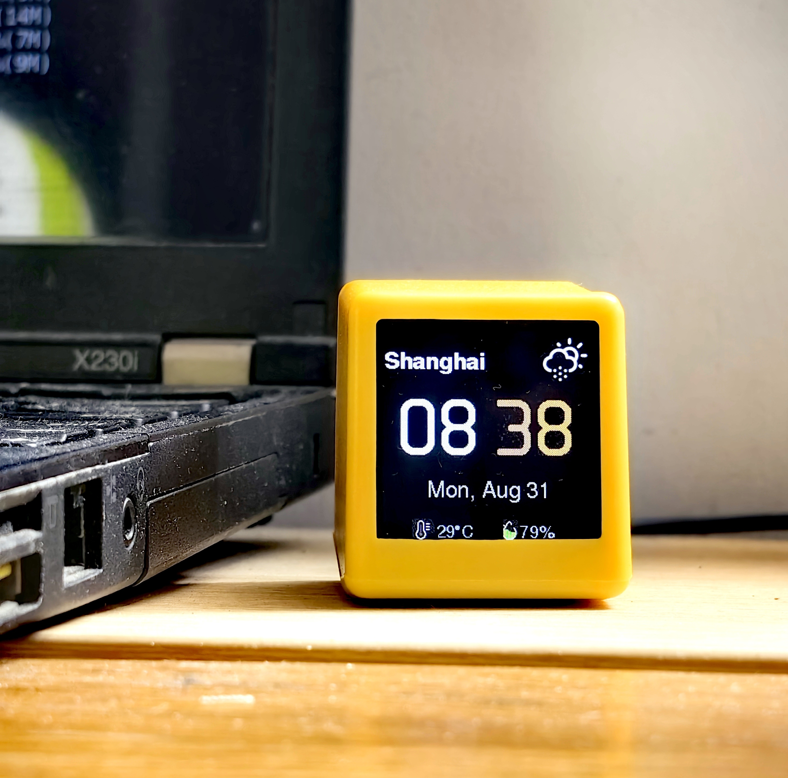

# Rubato

[English](README.md) | 简体中文

Rubato 让 AI 的工作状态在桌面实体设备上可见。本仓库为每个受支持的编码
智能体各提供一个 Rubato 插件，一个插件一个目录。设备固件在
[lovaxi/Rubato_Device](https://github.com/lovaxi/Rubato_Device)。




```
模型调用 ──> Rubato 插件 ──> EMQX 服务器 ──> Rubato 设备（TFT 屏幕）
```

| 目录 | 智能体 | 状态 |
|---|---|---|
| [dsh/](dsh/) | DeepSeek Harness | 可用 |
| openclaw/ | OpenClaw | 计划中 |
| codex/ | Codex | 计划中 |
| claude-code/ | Claude Code | 计划中 |
| cursor/ | Cursor | 计划中 |
| [opencode/](opencode/) | OpenCode | 可用 |

## MQTT 契约

所有插件发布相同的消息到 `rubato/<deviceId>/state`——每台设备一个主题。
认证与设备固件一致：username = deviceId（`RUBATO-xxxxxx`），password = 对应
token。MQTT 3.1.1 over TLS（8883），单条持久连接。

| 消息 | 载荷 | 说明 |
|---|---|---|
| `Estimate` | `{ model, state, ts, estSec }` | 预估时长（秒） |
| `Thinking` | `{ model, state, ts }` | 首个思考片段 |
| `Generating` | `{ model, state, ts }` | 首个回答/工具片段 |
| `Done` | `{ model, state, ts }` | 中间工具调用步骤不发送 Done |

设备屏幕显示模型名和随阶段变色的呼吸光环——思考时奶油色慢呼吸，生成时
冰蓝色快呼吸，结束时绿色收尾。当预估时长较长且处于工作时间，设备会全屏
显示健康提醒（喝水 / 休息时间到了）。

## 安装

### DeepSeek Harness

在 DSH 对话里粘贴：

```text
Install the Rubato plugin for DSH from https://github.com/lovaxi/Rubato_Plugins/dsh
```

这就是全部安装步骤。助手会把插件包复制到位并注册，然后提醒你重启。重启后：

1. 控制台会打印 `SETUP REQUIRED` 指南，并自动生成配置模板。
2. 把设备贴纸上的两个值填进去——username = deviceId（`RUBATO-xxxxxx`），
   password = 对应 token——可以自己编辑文件，或直接告诉助手。

保存即完成——插件在下一条消息自动启用，无需重启。

### OpenCode

在 opencode 对话里粘贴：

```text
Install the Rubato plugin for OpenCode from https://github.com/lovaxi/Rubato_Plugins/opencode
```

这就是全部安装步骤。助手会把插件包复制到位（项目 `.opencode/plugins/` 或
全局 `~/.config/opencode/plugins/`），然后提醒你重启。重启后：

1. 控制台会打印 `SETUP REQUIRED` 指南，并自动生成配置模板。
2. 把设备贴纸上的两个值填进去——username = deviceId（`RUBATO-xxxxxx`），
   password = 对应 token——可以自己编辑文件，或直接告诉助手。

保存即完成——插件在下一条消息自动启用，无需重启。

### OpenClaw / Codex / Claude Code / Cursor

计划中。

## 许可证

[GPL-3.0](https://www.gnu.org/licenses/gpl-3.0.html)
